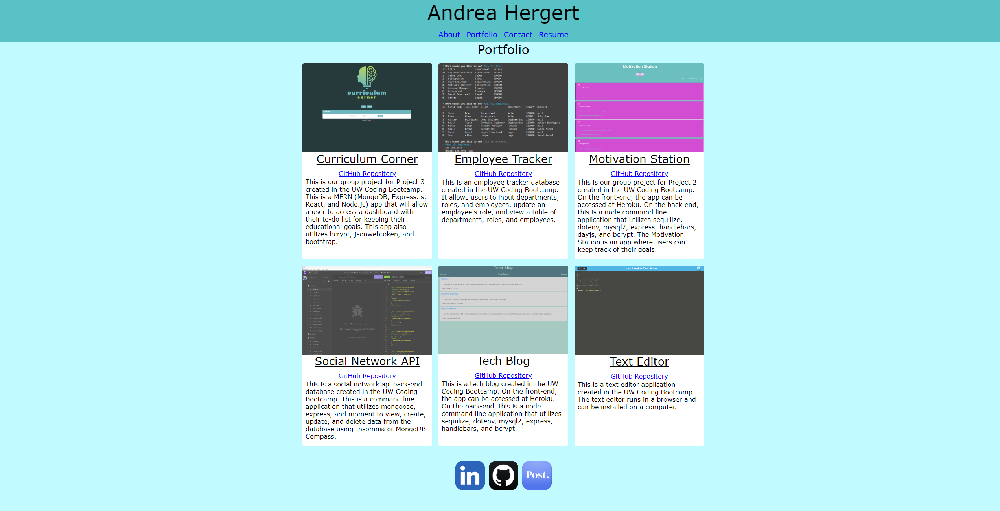
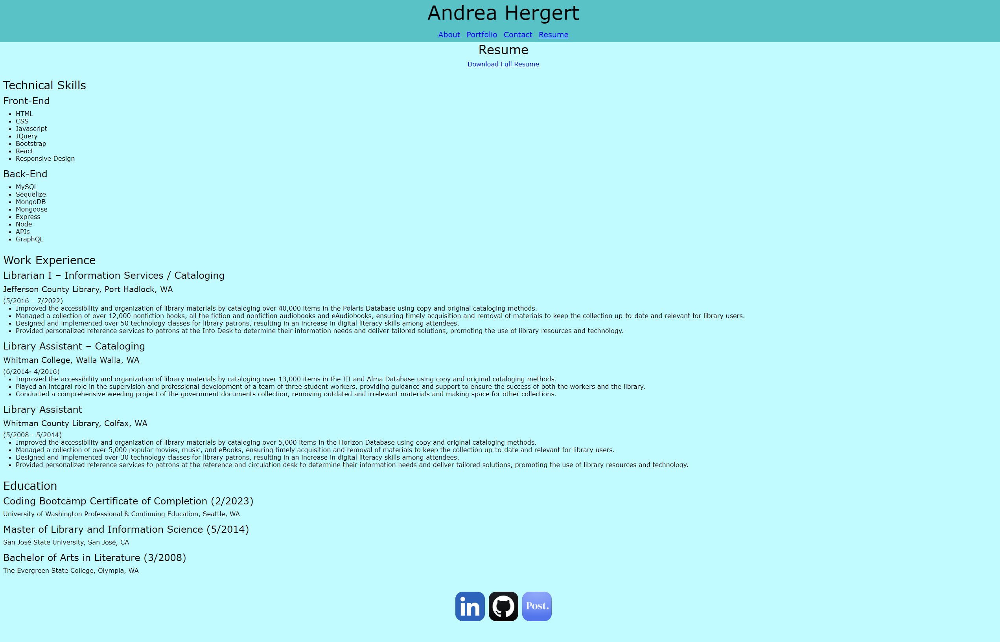

# Portfolio

## Licensing:

## Table of Contents 
- [Description](#description)
- [Installation](#installation)
- [Usage](#usage)
- [License](#license)
- [Contributing](#contributing)
- [Tests](#tests)
- [Questions](#questions)

## Description:
This is my portfolio that shows information about myself, examples of my applications, contact info, and resume.  It was created using React and it utilizes bootstrap.

## Usage:

Webpage: https://andreahergert.github.io/portfolio/

Screenshots:

Homepage / About Me

Portfolio

Contact Me

Resume

## License:
MIT

## Contributing:
No contributions

## Tests:
None

## Questions:
- Github: [andreahergert](https://github.com/andreahergert)
- Email: ahergert24@hotmail.com 